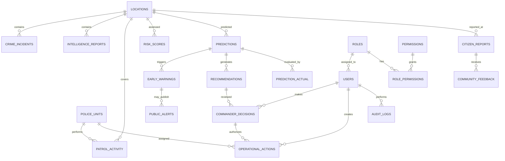

# ERD — PREDIKSI PRESISI

## Status
Baseline arsitektur database untuk prototype/MVP.

Tabel inti mengikuti spesifikasi: `crime_incidents`, `intelligence_reports`, `patrol_activity`, `police_units`, `locations`, `citizen_reports`, `public_alerts`, `community_feedback`, `risk_scores`, `predictions`, `early_warnings`, `recommendations`, `commander_decisions`, `operational_actions`, `prediction_actual`, `users`, `roles`, `permissions`, dan `audit_logs`. fileciteturn2file1

`role_permissions` adalah tambahan teknis yang direkomendasikan untuk menghubungkan role dan permission (many-to-many).

## Alur relasi

```text
locations
  ├──< crime_incidents
  ├──< intelligence_reports
  ├──< patrol_activity
  ├──< risk_scores
  ├──< predictions
  └──< citizen_reports

police_units
  ├──< patrol_activity
  └──< operational_actions

predictions
  ├──< early_warnings
  ├──< recommendations
  └──< prediction_actual

recommendations
  └──< commander_decisions
          └──< operational_actions

roles
  ├──< users
  └──< role_permissions >── permissions

users
  ├──< commander_decisions
  ├──< operational_actions
  └──< audit_logs

early_warnings
  └──< public_alerts

citizen_reports
  └──< community_feedback
```

## Mermaid ERD



## Keputusan desain

1. `location_id` menjadi referensi master wilayah/grid.
2. PostgreSQL/PostGIS dapat menyimpan `geometry(Point,4326)` untuk analitik geospasial.
3. Prediction adalah wilayah + waktu, bukan individu. fileciteturn2file4
4. Recommendation tidak boleh langsung menjadi operational action; harus melewati commander decision/human review. fileciteturn2file15
5. `prediction_actual` menjadi dasar evaluation.
6. Bobot risk score dan threshold warning belum final; jangan di-hardcode sebagai fakta.
7. Identitas pribadi korban/pelaku/saksi tidak diperlukan untuk PoC. fileciteturn2file11
