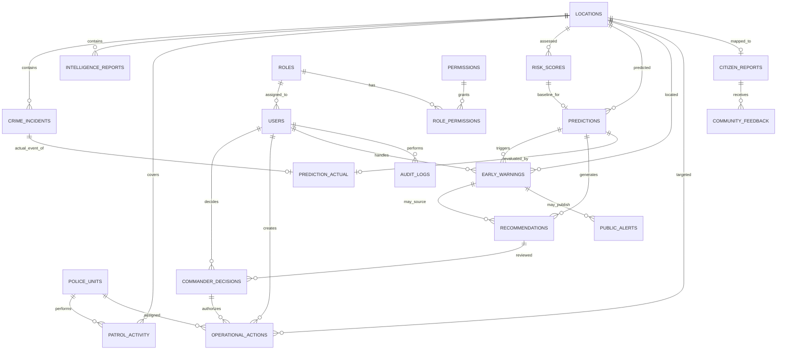

# ERD — PREDIKSI PRESISI

## Status

Baseline arsitektur database untuk prototype/MVP. Selaras dengan `docs/02-data-dictionary.md` dan CLAUDE.md §19–§20.
Perubahan pada revisi ini menutup konflik C-01, C-02, dan C-03 dari audit TASK 000.

Entitas kanonik (CLAUDE.md §20): `locations`, `police_units`, `crime_incidents`, `intelligence_reports`, `patrol_activity`, `citizen_reports`, `public_alerts`, `community_feedback`, `risk_scores`, `predictions`, `early_warnings`, `recommendations`, `commander_decisions`, `operational_actions`, `prediction_actual`, `users`, `roles`, `permissions`, `role_permissions`, `audit_logs`.

**Tidak ada tabel baru yang ditambahkan** pada revisi ini (CLAUDE.md §37 — gunakan solusi paling sederhana yang memenuhi requirement).

---

## Dua layer risiko (`TECHNICAL DECISION`)

`risk_scores` dan `predictions` **bukan dua tahap dari satu rantai**, melainkan dua produk analitik dengan horizon waktu berbeda:

```text
risk_scores   → risiko KONDISI BERJALAN pada (lokasi × jendela × ancaman × tanggal penilaian)
                dipakai sebagai layer "Current Risk" (CLAUDE.md §24, TASK 082)

predictions   → perkiraan untuk jendela waktu KE DEPAN, membawa risk_score + confidence sendiri
                dipakai sebagai layer "Predictive Risk" (TASK 083)
                menjadi satu-satunya sumber early_warnings dan recommendations
```

Rantai `Prediction → Risk Score → Early Warning` pada CLAUDE.md §13 dibaca sebagai: *prediksi menghasilkan skor risikonya sendiri, dan skor itulah yang memicu peringatan* — konsisten dengan kolom `predictions.risk_score`.
Urutan TASK 102 (risk score) sebelum TASK 103 (prediction) pada roadmap adalah **urutan membangun**, bukan urutan aliran data.

Penelusuran opsional disediakan lewat `predictions.baseline_risk_score_id` (nullable).

---

## Alur relasi

```text
locations
  ├──< crime_incidents
  ├──< intelligence_reports
  ├──< patrol_activity
  ├──< risk_scores
  ├──< predictions
  ├──< early_warnings
  ├──< operational_actions
  └──< citizen_reports            (nullable — dipetakan setelah geo-processing)

police_units
  ├──< patrol_activity
  └──< operational_actions

risk_scores
  └──< predictions                (opsional, penelusuran baseline)

predictions
  ├──< early_warnings
  ├──< recommendations
  └──< prediction_actual          (nullable — lihat false negative)

crime_incidents
  └──< prediction_actual          (nullable — kejadian aktual yang dievaluasi)

early_warnings
  ├──< recommendations            (nullable)
  └──< public_alerts

recommendations
  └──< commander_decisions
          └──< operational_actions

citizen_reports
  └──< community_feedback

roles
  ├──< users
  └──< role_permissions >── permissions

users
  ├──< commander_decisions        (decision_by)
  ├──< operational_actions        (created_by)
  ├──< early_warnings             (acknowledged_by / resolved_by)
  └──< audit_logs                 (nullable untuk system event)
```

---

## Mermaid ERD



---

## Keputusan desain

1. **`location_id` adalah referensi wilayah/grid kanonik** untuk seluruh tabel transaksi (CLAUDE.md §19). Data import yang hanya membawa `grid_id` dipetakan melalui `locations.grid_id`; `kecamatan`/`kelurahan` tidak diduplikasi di tabel transaksi.
2. PostgreSQL/PostGIS menyimpan `geometry(Point,4326)` untuk analitik geospasial. Geometri poligon per grid belum ditambahkan — menunggu keputusan ukuran grid & sumber batas wilayah (U-04).
3. Prediction adalah **wilayah + waktu + jenis ancaman**, bukan individu.
4. Recommendation tidak boleh langsung menjadi operational action; wajib melalui commander decision (CLAUDE.md §13).
5. `operational_actions` hanya boleh dibuat dari keputusan `APPROVED`/`MODIFIED`, dan mencatat `created_by`.
6. **`prediction_actual` dapat merepresentasikan false negative**: `prediction_id` nullable, `actual_incident_id` nullable, `match_type ∈ {HIT, FALSE_POSITIVE, FALSE_NEGATIVE}` (CLAUDE.md §26). Tanpa ini, kejadian yang tidak diprediksi tidak terlihat dan recall tidak dapat dihitung.
7. **`citizen_reports.location_id`** ditambahkan (nullable) — sebelumnya ERD menyatakan relasi ini tetapi data dictionary tidak memilikinya (C-03).
8. Bobot risk score dan threshold warning belum final; tidak boleh di-hardcode. Versi konfigurasi dicatat pada `risk_scores.weights_version` dan `early_warnings.threshold_version`.
9. Identitas pribadi korban/pelaku/saksi tidak diperlukan untuk PoC.
10. `role_permissions` membawa kolom `scope` untuk menegakkan pembatasan jurisdiksi/fungsi di backend.
11. `audit_logs` bersifat append-only; tidak ada relasi tulis dari modul mana pun selain penulisan event.

---

*Sumber konsep: dokumen PREDIKSI PRESISI pada `docs/source/`.*
